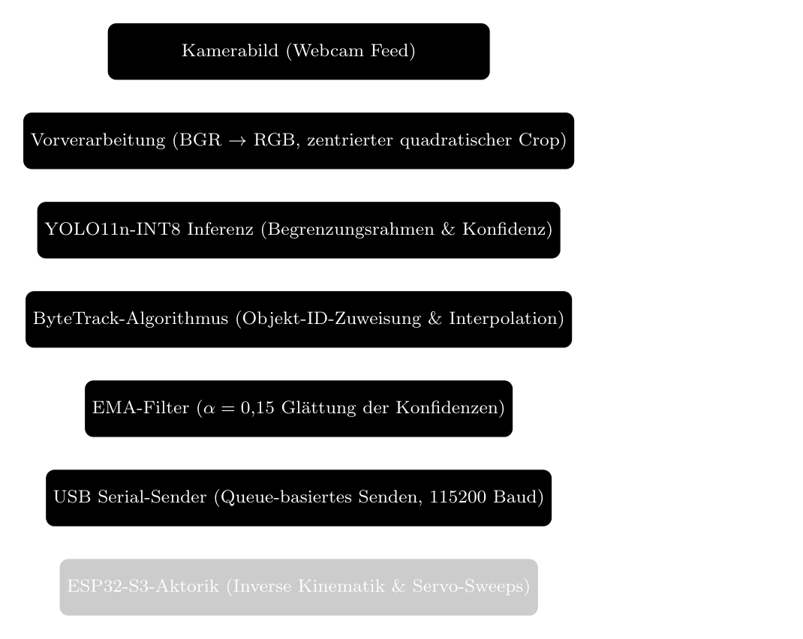

# MIRA — Machine Intelligence for Recycling Automation

[](https://www.jugend-forscht.de/)
[](https://www.python.org/downloads/release/python-3110/)
[](LICENSE)
[](https://github.com/jeremy341/MIRA-AI/actions/workflows/ci.yml)
[](https://github.com/jeremy341/MIRA-AI/commits/main)

A computer-vision research project for recycling detection, targeting eventual deployment on a Raspberry Pi Zero 2W and tabletop sorting robot. Detection models and historical experiments exist; Raspberry Pi benchmarking, robot integration, distillation, and end-to-end dashboard verification are pending.

> **Local demo:** `.\mira live` opens the model picker when compatible local model binaries are present.
> **Dashboard status:** an implementation exists under `src/dashboard/`, but end-to-end camera/model/browser integration has not yet been verified.

<!-- ============================================================ -->
<!-- PLACEHOLDER: Add a 10-second GIF of live detection here       -->
<!-- Record `.\mira live --model mira_exp014.pt` detecting objects -->
<!-- Save as assets/demo-live-detection.gif                        -->
<!-- ============================================================ -->
<!--  -->

---

## Features

- **Historical and current experiments** — measured results are separated from paused plans
- **Research Pipeline** — YAML-driven config, plugin CLI registry, dataset registry, model adapters, configurable training
- **Third-party model support** — drop `.pt`/`.tflite`/`.pth` + optional YAML descriptor in `models/detection/` for instant benchmarking
- **Dashboard implementation** — FastAPI, WebSocket, and browser UI components; integration verification pending
- **Compact exports** — local INT8 artifacts include a 2.61 MB classifier and 2.90 MiB detector; target-device performance is unmeasured
- **Multi-dataset fusion** — TACO + TrashNet + Roboflow + WaRP, tested in 4 combinations

---

## Table of Contents

- [Quick Start](#quick-start)
- [Configuration](#configuration)
- [Architecture](#architecture)
- [Research Pipeline](#research-pipeline)
- [Models](#models)
- [Results](#results)
- [Dataset](#dataset)
- [Dashboard](#dashboard)
- [CLI Reference](#cli-reference)
- [Training on Kaggle](#training-on-kaggle)
- [Hardware Requirements](#hardware-requirements)
- [Project Structure](#project-structure)
- [Known Limitations](#known-limitations)
- [Reproducibility](#reproducibility)
- [Related Work](#related-work)
- [Citation](#citation)
- [Contributing](#contributing)
- [License](#license)
- [Acknowledgments](#acknowledgments)

---

## Quick Start

### Installation

```bash
git clone https://github.com/jeremy341/MIRA-AI.git
cd MIRA-AI
python -m venv .venv
.venv\Scripts\Activate.ps1      # Windows PowerShell
pip install -r requirements.txt
```

> **Note:** Development dependencies (pytest, mypy, ruff) are included in `requirements.txt`. For a production-only install, install only the core packages listed at the top of the file.

> **Fresh-clone note:** datasets and trained model binaries are gitignored. Model binaries are published separately in the public [Hugging Face repository](https://huggingface.co/Jeremy341/MIRA-AI); the CLI downloads them into the local `models/detection/` directory.

### Live Detection

> **Platform note:** On Windows, use `.\mira` (PowerShell) or `launchers\mira.bat` (CMD). On Linux/macOS, use `python -m src` or `./launchers/mira.sh`.

```bash
# Interactive model picker (arrow keys to choose)
.\mira live

# Direct launch with best model
.\mira live --model mira_exp014.pt

# With custom settings
.\mira live --model mira_exp014.pt --conf 0.25 --reject 0.55 --resolution 1280x720
```

### Dashboard

The command is retained for development. Do not treat it as a verified demo until camera, model loading, streaming, and the browser UI pass an end-to-end integration check.

```bash
.\mira dashboard                           # Opens at http://127.0.0.1:8000
.\mira dashboard --port 8080               # Custom port
.\mira dashboard --host 0.0.0.0            # Listen on all interfaces
.\mira dashboard --host 0.0.0.0 --port 80  # Both flags combined
```

### Research Pipeline

```bash
# List available dataset sources
.\mira datasets

# Merge selected sources into a unified training set
.\mira merge --sources taco_trashnet roboflow --output datasets/mira_merged

# Train via experiment config
.\mira train --config experiments/exp014_yolo11n_multidataset.yaml

# Or train with inline flags
.\mira train --model yolo11n.pt --dataset datasets/mira_v2/dataset.yaml --epochs 50

# Benchmark multiple models
.\mira benchmark --models mira_exp014.pt mira_exp014_int8.tflite

# List discovered models
.\mira models
```

<details open>
<summary><strong>All CLI Commands</strong></summary>

| Command | Description |
|---|---|---|
| `.\mira live` | Interactive model picker — arrow keys to choose, Enter to confirm |
| `.\mira live --model <file>` | Bypass picker — launch directly with a specific model |
| `.\mira dashboard` | Start the unverified dashboard implementation for development |
| `.\mira dashboard --host 0.0.0.0 --port 8000` | Bind the development dashboard to a custom host/port |
| `.\mira train` | Train a YOLO detection model via the research pipeline |
| `.\mira train --config <file>` | Train from experiment YAML |
| `.\mira train --model yolo11n.pt --dataset <path> --epochs 50` | Train with inline flags |
| `.\mira eval-yolo --model <file>` | Evaluate a YOLO detection model on test set |
| `.\mira benchmark --models <file1> <file2> ...` | Compare models by accuracy and latency |
| `.\mira export --model <file> --formats tflite_int8` | Export trained `.pt` to TFLite / ONNX |
| `.\mira merge --sources taco_trashnet roboflow --output <dir>` | Merge registered datasets into unified YOLO dataset |
| `.\mira datasets` | List registered dataset sources from `datasets/registry/*.yaml` |
| `.\mira validate` | Validate a YOLO-format dataset's annotation structure |
| `.\mira download` | Download pretrained models from Hugging Face Hub |
| `.\mira models` | List all discovered model files in `models/` |
| `.\mira experiments` | List all experiment YAML configs in `experiments/` |
| `.\mira doctor` | Run comprehensive environment and project health check |
| `.\mira diagnostics` | Check hardware capabilities (GPU, NPU, TPU) |
| `.\mira config` | Display current project configuration |
| `.\mira generate kaggle --config <file>` | Generate cloud training scripts (Kaggle, Colab, Docker) |
| `.\mira wizard` | Interactive training setup wizard |
| `scripts/capture_classifier_frames.py` | Capture Stage-A classifier images from a webcam |

</details>

<details>
<summary><strong>Live Command Flags</strong></summary>

| Flag | Default | Description |
|---|---|---|
| `--model` | Interactive picker | Model filename (omit for arrow-key picker) |
| `--camera` | `0` | Camera device index |
| `--resolution` | `640x360` | Capture resolution: `640x360`, `1280x720`, `1920x1080` |
| `--conf` | `0.25` | Confidence threshold |
| `--reject` | `0.25` | Reject threshold (detections below this labeled "unsicher") |
| `--target-latency` | `1000` | Target latency in ms (prevents automatic frame skipping) |

</details>

---

## Installation Troubleshooting

| Issue | Solution |
|-------|----------|
| `ai_edge_litert` import error | Windows-only: install via `pip install ai-edge-litert`. Not needed on Raspberry Pi (use `tflite-runtime`). |
| CUDA out of memory | Use `--imgsz 320` instead of 640, or close other GPU applications. |
| Camera not opening (Windows) | Ensure no other app is using the webcam. Try `--camera 1` to switch device index. |
| `No module named 'ultralytics'` | Run `pip install ultralytics>=8.3.0` |

---

## Configuration

MIRA uses `mira.yaml` as the single source of truth for project-wide settings. All scripts, CLI commands, and the pipeline read from this file.

```yaml
# mira.yaml — key settings
classes:
  names: ["glass", "metal", "paper", "plastic", "trash"]
  count: 5

training:
  default_model: yolo11n.pt
  default_epochs: 120
  default_batch_size: 32
  default_imgsz: 640

inference:
  reject_threshold: 0.55
  default_conf: 0.5
  default_iou: 0.7
```

CLI flags override `mira.yaml` defaults:
```bash
.\mira train --epochs 200 --batch-size 16    # Override training defaults
.\mira live --conf 0.25 --reject 0.60       # Override inference defaults
```

## Dataset Access

Training datasets are not included in Git. The current no-SortWaste build uses:

1. **dmedhi garbage image classification/detection**
2. **TACO** (Trash Annotations in Context)
3. **Roboflow Raw**
4. **SAM-labeled TrashNet**

`scripts/build_balanced_dataset.py` documents the expected local directories,
remapping, deterministic TACO split, balancing, and manifest generation. Verify
the resulting manifest against the counts in
[`DATASETS_AND_BENCHMARKS.md`](docs/DATASETS_AND_BENCHMARKS.md). The commands below
belong to the older EXP-014 through EXP-017 dataset-comparison workflow and do
not recreate the current balanced dataset:

```bash
.\mira merge --sources taco_trashnet roboflow              # → datasets/mira_tnr/
.\mira merge --sources taco_trashnet warp                  # → datasets/mira_tnw/
.\mira merge --sources warp                                # → datasets/mira_warp_only/
.\mira merge --sources taco_trashnet roboflow warp         # → datasets/mira_all/

# Preview without copying
.\mira merge --sources taco_trashnet roboflow --dry-run
```

---

## Architecture

```
Webcam Input
     │
     ▼
┌─────────────────────────────────────────────────────┐
│  Stage A: Classification (single object per frame)  │
│                                                     │
│  Input (224×224) → MobileNetV2 → Dense(128) →       │
│  Dropout(0.2) → Softmax(4 classes)                  │
│                                                     │
│  Best model: mira_classifier_int8.tflite            │
│  Accuracy: 87.42% | Size: 2.61 MB | ~97 FPS CPU     │
└─────────────────────────────────────────────────────┘
     │
     ▼
┌─────────────────────────────────────────────────────┐
│  Stage B: Detection (multiple objects per frame)    │
│                                                     │
│  Input (640×640) → YOLO11n → NMS →              │
│  Bounding Boxes + Class Labels + ByteTrack IDs      │
│                                                     │
│  Historical EXP-014 FP32: 60.7% mAP50              │
│  Older 6,802-image TACO + TrashNet + Roboflow set  │
└─────────────────────────────────────────────────────┘
     │
     ▼
┌─────────────────────────────────────────────────────┐
│  Stage C: Robotic Sorting (planned)                 │
│                                                     │
│  USB Serial → ESP32-S3 → 3-DOF Servo Arm →         │
│  Pick-and-place into sorted bins                    │
│                                                     │
│  Protocol: Python sends "metal 120\n" →             │
│  ESP32 responds "done\n"                            │
└─────────────────────────────────────────────────────┘
```

> **Note:** Stage A classifiers were trained on 4 classes (glass, metal, paper, plastic) without the trash class. The 87.42% accuracy applies to this 4-class task. Stage B detectors operate on all 5 classes including trash. Stage C and target-hardware deployment remain pending.



### Confidence Reject System

MIRA uses a 3-tier confidence system to handle uncertain detections:

| Tier | Confidence Range | Visual | Behavior |
|---|---|---|---|
| **Rejected** | conf < 0.25 | Not drawn | Ignored entirely |
| **Uncertain** | 0.25 ≤ conf < reject_threshold | Yellow box, "unsicher" | Shown but not counted in inventory |
| **Confident** | conf ≥ reject_threshold | Green box, class label | Counted in inventory |

The reject threshold is configurable via the dashboard slider or `--reject` CLI flag.

> **Note:** The 0.25 lower bound is only active when explicitly passed via `--conf 0.25` or when loading INT8 TFLite models (which auto-set conf to 0.25). With default `--conf 0.5`, only boxes with confidence ≥0.5 are drawn.

---

## Research Pipeline

MIRA includes a modular research pipeline for systematic experimentation. The pipeline is YAML-driven, plugin-based, and designed for extensibility.

```
 CLI (src/cli/)
    │
    ├─ datasets ──→ DatasetRegistry ──→ datasets/registry/*.yaml
   │                                        │
   ├─ merge ─────→ copy_passthrough ───────→ datasets/<merged>/
   │                copy_remapped_images         │
   │                                             ▼
   ├─ train ─────→ TrainingPipeline ──→ models/detection/*.pt
   │                (experiments/*.yaml)         │
   │                                             ▼
   ├─ export ────→ model.export() ────→ models/detection/*_int8.tflite
   │                                             │
   ├─ benchmark ─→ ModelBenchmark ───→ results/benchmark_*.json
   │                (YOLOAdapter,                   │
   │                 YOLOTFLiteAdapter,             ▼
   │                 ThirdPartyAdapter)       comparison_table()
   │
   └─ models ────→ ModelRegistry ────→ models/detection/*.pt + *.tflite + *.yaml
                   (auto-discovery)
```

### Extension Points

| What | Where | How |
|---|---|---|
| New CLI command | `src/pipeline/registry.py` | Add module, register with `@register_command` |
| New dataset source | `datasets/registry/` | Drop a YAML descriptor |
| New model format | `src/pipeline/models.py` | Add adapter class with `@register_model_adapter` |
| New training strategy | `src/pipeline/train.py` | Add strategy fn, expose as CLI flag |
| New export target | `src/pipeline/train.py` | Add exporter in `TrainingPipeline.export` |
| New benchmark metric | `src/pipeline/benchmark.py` | Add metric fn, include in report output |

### Adding a Third-Party Model

1. Place the model file (`.pt`, `.tflite`, `.pth`) in `models/detection/`
2. Create a YAML descriptor in `models/detection/` using the schema below:
   ```yaml
   name: "My Custom Model"
   type: tflite
   model_file: my_model.tflite
   imgsz: 320
   class_names: [glass, metal, paper, plastic, trash]
   ```
3. Run `.\mira models` to verify it appears
4. Run `.\mira benchmark --models my_custom_model --dataset datasets/mira_all`

Ultralytics-compatible models (`.pt`, `.tflite`) work out of the box — the adapter loads them via `ultralytics.YOLO()` automatically.

---

## Models

### Stage A — Classification

| Model | Val Accuracy | Size | Speed (CPU) | Notes |
|---|---|---|---|---|
| `mira_classifier_baseline.keras` | 61.00% | 45.71 MB | ~10 FPS | 3-layer custom CNN — baseline only |
| `mira_classifier_transfer.keras` | 84.28% | 9.25 MB | ~50 FPS | MobileNetV2 frozen base, fast to train |
| `mira_classifier_tuned.keras` | **87.42%** | 23.48 MB | ~35 FPS | MobileNetV2 fine-tuned, best Keras accuracy |
| `mira_classifier_fp32.tflite` | 87.42% | 8.49 MB | ~70 FPS | TFLite export, no quality loss |
| `mira_classifier_int8.tflite` | **87.42%** | **2.61 MB** | **~97 FPS** | Compact INT8 export; target-hardware validation pending |

### Stage B — Detection

| Model | mAP50 | Params | Size | Notes |
|---|---|---|---|---|---|
| `mira_exp019.pt` | **90.6%** | 2.58M | 5.47 MB | **Current recommended** — clean balanced dataset, repeatability run |
| `mira_exp018.pt` | 90.6% | 2.58M | 5.47 MB | Clean balanced dataset reference run |
| `mira_exp019_int8_640.tflite` | 86.2% | 2.58M | 2.90 MiB | Local validation result; target-hardware validation pending |
| `mira_exp014.pt` | **60.7%** | 2.58M | 5.21 MB | Historical FP32 result; 50.6% mAP50-95 |
| `mira_exp017.pt` | 59.3% | 2.58M | 5.21 MB | YOLO11n + all 4 sources |
| `mira_exp016.pt` | 58.8% | 2.58M | 5.21 MB | YOLO11n + WaRP only |
| `mira_exp015.pt` | 56.0% | 2.58M | 5.21 MB | YOLO11n + WaRP + TrashNet |
| `mira_exp013.pt` | 55.1% | 2.58M | 5.21 MB | YOLO11n + TACO + TrashNet |
| `mira_exp006.pt` | 39.4% | 3.01M | 5.94 MB | YOLOv8n multi-dataset, proven in demos |
| `mira_exp011.pt` | 35.0% | 3.01M | 5.94 MB | YOLOv8n TACO-only |
| `mira_exp009_int8.tflite` | 72.8% | 3.01M | 3.18 MB | **WEAK** — inflated by clean backgrounds |
| `mira_exp014_int8.tflite` | Not measured | 2.58M | 2.90 MiB | INT8 export; size measured, detection mAP pending |
| `mira_exp017_int8.tflite` | Not measured | 2.58M | 2.90 MiB | INT8 export; size measured, detection mAP pending |

> **Status:** EXP-019 PT is the current best measured detector on the clean balanced validation split. Raspberry Pi suitability still requires target-hardware evaluation.

---

## Results

### Classification — Transfer Learning Progression

| Experiment | Architecture | Dataset | Val Accuracy | Size |
|---|---|---|---|---|
| EXP-001 | Custom CNN (3-layer) | 796 images | 61.00% | 45.71 MB |
| EXP-002 | MobileNetV2 (frozen) | 796 images | 84.28% | 9.25 MB |
| EXP-003 | MobileNetV2 (fine-tuned) | 796 images | **87.42%** | 23.48 MB |
| EXP-004 | MobileNetV2 INT8 TFLite | 796 images | 87.42% | **2.61 MB** |

### Detection — 12 Experiments (EXP-005–017, excl. EXP-007)

> EXP-007 was an exploratory attempt and is excluded from the main results table.

| Exp | Model | Dataset | mAP50 | Platform |
|---|---|---|---|---|
| EXP-005 | YOLOv8n | Custom + TrashNet (~3,300 img) | 82.3% | Colab T4 |
| EXP-006 | YOLOv8n | Fused Wild + TrashNet | 39.4% | Colab T4 |
| EXP-008 | YOLOv8n | Pruned Tabletop (~3,000 img) | 39.6% | Colab T4 |
| EXP-009 | YOLOv8n | Pristine TrashNet (~2,527 img) | **72.8%** | Kaggle T4 |
| EXP-010 | YOLOv8n INT8 | Wild + TrashNet (quantized) | 35.0% | — |
| EXP-011 | YOLOv8n | TACO only (3,365 img) | 35.0% | Kaggle T4 |
| EXP-012 | YOLOv8n INT8 | TACO only (quantized) | 35.0% | — |
| **EXP-013** | **YOLO11n** | **TACO + TrashNet (4,024 img)** | **55.1%** | **Kaggle T4** |
| **EXP-014** | **YOLO11n FP32** | **mira_tnr (6,802 img)** | **60.7% mAP50 / 50.6% mAP50-95** | **Kaggle T4** |
| **EXP-015** | **YOLO11n** | **mira_tnw (~6,800 img)** | **56.0%** | **Kaggle T4** |
| **EXP-016** | **YOLO11n** | **mira_warp_only (~3,000 img)** | **58.8%** | **Kaggle T4** |
| **EXP-017** | **YOLO11n** | **mira_all (9,774 img)** | **59.3%** | **Kaggle T4** |

### 4-Dataset Comparison

To find the optimal training data mix, we trained YOLO11n on 4 dataset combinations:

| Model | Datasets | ~Images | mAP50 | Merge Command |
|---|---|---|---|---|
| Model 1 (EXP-014) | TACO + TrashNet + Roboflow | 6,802 | **60.7%** | `py mira merge --sources taco_trashnet roboflow` |
| Model 2 (EXP-015) | TACO + TrashNet + WaRP | ~6,800¹ | 56.0% | `py mira merge --sources taco_trashnet warp` |
| Model 3 (EXP-016) | WaRP only | ~3,000 | 58.8% | `py mira merge --sources warp` |
| Model 4 (EXP-017) | All four datasets | 9,774 | 59.3% | `py mira merge --sources taco_trashnet roboflow warp` |

¹ Raw WaRP contains ~10,000 images across 28 classes; only images with one of the 5 MIRA-mapped classes are kept, yielding ~2,800. Combined with TACO+TrashNet (3,924), the actual training set is ~6,800 images — consistent with EXP-015.

> **Key finding:** Roboflow (EXP-014) outperforms WaRP (EXP-015) by +4.7 pp mAP50. Adding all 4 sources (EXP-017) yields 59.3% — lower than EXP-014's 60.7% but higher than any other combination, suggesting quality > quantity: Roboflow's focused dataset beats larger but noisier unions.

### Field Benchmark — Real-World Validation

The existing table covers 11 models on the 805-image `mira_v2` validation set, not a documented real-webcam field collection.

(**Preliminary image-level class-presence F1** — see [field_benchmark_results.md](results/field_benchmark_results.md). It is not detection mAP, and the recorded FP32/INT8 threshold policy is inconsistent, so cross-format conclusions are not final.)

Full per-class metrics, confusion matrices, and training curves: [`results/experiments_log.md`](results/experiments_log.md)

---

## Dataset

The current no-SortWaste build is **6,898 images and 12,832 boxes**: 5,108/415/1,375 train/validation/test images. Exact split and source counts are in [`DATASETS_AND_BENCHMARKS.md`](docs/DATASETS_AND_BENCHMARKS.md) and [`docs/EVIDENCE_LEDGER.md`](docs/EVIDENCE_LEDGER.md). This local dataset is gitignored and differs from the historical datasets used for EXP-014 and EXP-017.

### Sources

The following is the historical source catalog used by EXP-013 through
EXP-017, not the composition table for the current no-SortWaste build.

| Dataset | Classes | Images | Format | Use | License |
|---|---|---|---|---|---|
| [TACO](https://github.com/pedropro/TACO) | 60 | 1,500 | COCO | Base detection data | CC-BY-4.0 |
| [TrashNet](https://github.com/garythung/trashnet) | 6 | 2,527 | Classification | Stage A + bbox via SAM | MIT-0 |
| [Roboflow Trash Detection](https://universe.roboflow.com/jerry-jukbu/trash-detection-1fjjc-uqlv1/dataset/dataset) | 64 | ~3,300 | YOLO | Multi-class detection | CC BY 4.0 |
| [WaRP](https://github.com/AIRI-Institute/WaRP) | 28 | ~10,000 | YOLO | Glass/plastic detection | Research use only (contact authors) |

### Class Schema

All datasets are remapped to 5 unified classes:

| Class | TACO | TrashNet | Roboflow | WaRP |
|---|---|---|---|---|
| glass | Glass jar | Glass | Glass | Glass bottle |
| metal | Metal can | Metal | Metal | Aluminum can |
| paper | Paper | — | Cardboard, Paper | Paper bag |
| plastic | Plastic bottle | Plastic | Plastic, Styrofoam | Plastic bottle |
| trash | Other | — | Trash, Biodegradable | — |

### Merge Scripts

These commands reproduce historical merge recipes, not the current balanced
dataset protocol.

```bash
# CLI merge (preferred — reads registry from datasets/registry/*.yaml)
.\mira merge --sources taco_trashnet roboflow               # → datasets/mira_tnr/
.\mira merge --sources taco_trashnet warp                   # → datasets/mira_tnw/
.\mira merge --sources warp                                 # → datasets/mira_warp_only/
.\mira merge --sources taco_trashnet roboflow warp          # → datasets/mira_all/

# Preview without copying
.\mira merge --sources taco_trashnet roboflow --dry-run
```

---

## Dashboard

<!-- ============================================================ -->
<!-- PLACEHOLDER: Add dashboard screenshot here                   -->
<!-- Run `.\mira dashboard`, open http://127.0.0.1:8000            -->
<!-- Screenshot the full clean light theme interface              -->
<!-- Save as assets/dashboard-screenshot.png                      -->
<!-- ============================================================ -->
<!--  -->

The repository contains a FastAPI+WebSocket dashboard implementation and browser UI. Its advertised camera, model-swapping, streaming, and inventory workflow has not yet been verified end to end, so the items below describe intended implementation behavior rather than a validated product.

### Features

- **Live video feed** with bounding boxes and confidence scores
- **Model selector** — switch between any detection model on the fly
- **Confidence slider** — adjust detection threshold in real-time
- **Reject threshold slider** — set the "unsicher" boundary (0.10–1.00)
- **IoU slider** — adjust non-maximum suppression overlap
- **Image size selector** — 320, 416, or 640
- **Tracking toggle** — enable/disable ByteTrack object tracking
- **Camera index** — switch between connected cameras
- **Real-time inventory chart** — Chart.js bar chart counting sorted objects by material
- **FPS and latency metrics** — updated per frame

### Launch

```bash
.\mira dashboard                           # http://127.0.0.1:8000
.\mira dashboard --port 8080               # Custom port
.\mira dashboard --host 0.0.0.0            # Listen on all interfaces
.\mira dashboard --host 0.0.0.0 --port 80  # Both flags combined
```

---

## CLI Reference

All commands are accessed via `.\mira <command>` (Windows) or `python -m src <command>` (Linux/macOS). Run `.\mira <command> --help` for full flag details.

| Category | Command | Description |
|---|---|---|
| **Detection** | `live` | Interactive model picker → real-time webcam detection |
| | `live --model <file> --conf 0.5` | Bypass picker with custom threshold |
| | `eval-yolo --model <file>` | Evaluate a YOLO detection model on test set |
| **Dashboard** | `dashboard` | Start the dashboard implementation; integration unverified |
| | `dashboard --host 0.0.0.0 --port 8000` | Custom host/port |
| **Training** | `train --config <file>` | Train from experiment YAML config |
| | `train --model yolo11n.pt --dataset <path>` | Train with inline flags |
| | `wizard` | Interactive training setup wizard |
| **Export** | `export --model <file> --formats tflite_int8` | Export `.pt` to TFLite / ONNX |
| **Data** | `datasets` | List registered dataset sources |
| | `merge --sources ... --output <dir>` | Merge sources into unified YOLO dataset |
| | `validate` | Validate YOLO dataset annotation structure |
| **Models** | `models` | List all discovered model files |
| | `benchmark --models <file1> <file2>` | Compare models by accuracy and latency |
| | `download` | Download pretrained models from Hugging Face |
| **Experiments** | `experiments` | List all experiment YAML configs |
| **System** | `doctor` | Comprehensive environment and project health check |
| | `diagnostics` | Check hardware capabilities (GPU, NPU, TPU) |
| | `config` | Display current project configuration |
| **Cloud** | `generate` | Generate cloud training scripts (Kaggle, Colab, Docker) |

```bash
# Full pipeline example
.\mira datasets                                                    # List available sources
.\mira merge --sources taco_trashnet roboflow --output datasets/mira_tnr
.\mira train --config experiments/exp014_yolo11n_multidataset.yaml
.\mira export --model models/detection/mira_exp014.pt --formats tflite_int8
.\mira benchmark --models mira_exp014.pt mira_exp014_int8.tflite --dataset datasets/mira_tnr
.\mira models                                                       # Verify model discovery
```

---

## Training on Kaggle

All detection models train with YOLO11n using `scripts/train_detector_kaggle.py` on Kaggle (free T4 GPU).

### Steps

1. Upload the dataset ZIP to Kaggle
2. Open the notebook and run with argparse flags:

```bash
# Model 1 (YOLO11n, 120 epochs)
py scripts/train_detector_kaggle.py --dataset mira_tnr

# Model 2
py scripts/train_detector_kaggle.py --dataset mira_tnw

# Model 3 (WaRP only, fewer epochs)
py scripts/train_detector_kaggle.py --dataset mira_warp_only --epochs 80 --batch-size 16

# Model 4 (all data, longer training)
py scripts/train_detector_kaggle.py --dataset mira_all --epochs 200

# Different architecture
.\mira train --model yolo11n.pt --dataset datasets/mira_tnr/dataset.yaml --epochs 120
```

### Cloud Training Flags (for `mira generate` output)

| Flag | Default | Description |
|---|---|---|
| `--dataset` | `mira_tnr` | Kaggle dataset name |
| `--model` | `yolo11n.pt` | Base model architecture |
| `--epochs` | `120` | Training epochs |
| `--batch-size` | `32` | Batch size |
| `--img-size` | `640` | Image size |
| `--patience` | `30` | Early stopping patience |
| `--device` | `0` | GPU device ID |
| `--lr0` | `0.01` | Initial learning rate |

---

## Hardware Requirements

| Use Case | Minimum Hardware | Recommended |
|---|---|---|
| Running inference | Any modern CPU | Intel i5 / Ryzen 5 or better |
| Live detection (`.\mira live`) | USB webcam at 640x360 | Any webcam supporting 640x360 |
| Retraining Stage A | CPU only is fine | GPU (CUDA) for speed |
| Retraining Stage B (YOLO) | GPU required | Google Colab / Kaggle T4 |
| Edge deployment target | Raspberry Pi Zero 2W | Raspberry Pi 4 |

### Camera Optimizations

All camera scripts apply these optimizations for stable, low-latency capture:

| Optimization | Setting | Effect |
|---|---|---|
| **MJPG codec** | `CAP_PROP_FOURCC = MJPG` | 3–5x faster frame decode vs. YUY2 |
| **DirectShow backend** | `cv2.CAP_DSHOW` | Windows-native driver, lower overhead |
| **Buffer size 1** | `CAP_PROP_BUFFERSIZE = 1` | Always delivers the freshest frame |
| **Explicit 30 FPS** | `CAP_PROP_FPS = 30` | Prevents silent 15 FPS default |
| **Manual exposure** | `CAP_PROP_AUTO_EXPOSURE = 1` | Prevents per-frame brightness shifts |
| **Autofocus off** | `CAP_PROP_AUTOFOCUS = 0` | Eliminates mid-inference blur |
| **Warmup frames** | 10 frames discarded on start | Lets auto-exposure settle |

The live detection engine runs camera capture in a **background thread** (`CameraStream` class), decoupling frame grabbing from inference so the main loop always processes the newest available frame.

---

## Project Structure

```text
MIRA-AI/
├── mira.yaml                       # Single source of truth: classes, paths, training defaults
│
├── src/                            # Runtime packages
│   ├── __init__.py                 # Version, imports
│   ├── __main__.py                 # Entry point (python -m src)
│   ├── config.py                   # Shared paths, constants, and utilities
│   ├── inference_engine.py         # Camera setup, model loading, inference loop
│   ├── visualize.py                # Bounding-box drawing with 3-tier confidence
│   ├── logger.py                   # Singleton logger
│   ├── model_picker.py             # Interactive arrow-key model selector
│   ├── hardware.py                 # GPU/NPU/TPU detection and capabilities
│   ├── deploy.py                   # Model deployment and quantization helpers
│   ├── exceptions.py               # Custom exception classes
│   ├── version.py                  # Project version constants
│   ├── serialization.py            # Model serialization utilities
│   ├── cli/                        # CLI subcommand modules
│   │   ├── __init__.py             # CLI registration and argument parser
│   │   ├── inference.py            # live, eval-yolo commands
│   │   ├── train.py                # train, wizard commands
│   │   ├── data.py                 # datasets, merge, validate commands
│   │   ├── generate.py             # generate command (Kaggle, Colab, Docker)
│   │   ├── dashboard.py            # dashboard command
│   │   ├── system.py               # doctor, diagnostics, config, models, experiments, benchmark commands
│   │   └── wizard.py               # Interactive training setup wizard
│   ├── dashboard/                   # FastAPI+WebSocket web control center
│   │   ├── backend/
│   │   │   ├── main.py             # FastAPI server (REST + WebSocket)
│   │   │   ├── camera_service.py   # Camera + YOLO inference management
│   │   │   ├── websocket_handler.py # WebSocket video streaming
│   │   │   ├── models.py           # Pydantic data models
│   │   │   ├── requirements.txt    # Dashboard dependencies
│   │   │   └── run.py              # Server startup script
│   │   └── frontend/
│   │       └── dashboard.html      # Clean light-theme frontend
│   └── pipeline/                   # Research pipeline framework
│       ├── __init__.py             # Public API exports
│       ├── registry.py             # Plugin registry: @register_command, @register_dataset_source
│       ├── dataset.py              # DatasetRegistry: YAML-based dataset source management
│       ├── models.py               # Model adapters: YOLOAdapter, YOLOTFLiteAdapter, ThirdPartyAdapter
│       ├── train.py                # TrainingPipeline: configurable YOLO training
│       ├── strategies.py           # Training strategy implementations
│       ├── validators.py           # Dataset + YAML validators
│       └── benchmark.py            # ModelBenchmark: accuracy + latency comparison
│
├── scripts/                        # Training, cloud, and utility scripts
│   ├── train_detector_kaggle.py    # Configurable Kaggle training
│   ├── generate_kaggle.py          # Kaggle notebook generator
│   ├── generate_colab.py           # Colab notebook generator
│   ├── generate_docker.py          # Dockerfile generator
│   ├── push_to_hub.py              # Hugging Face Hub upload
│   ├── merge_utils.py              # Shared merge helpers
│   ├── capture_classifier_frames.py  # Webcam data collection (Stage A)
│   ├── build_balanced_dataset.py   # Reproducible final dataset builder
│   ├── evaluate.py                 # Standalone evaluation tool
│   ├── profile.py                  # Performance profiler
│   └── compare.py                  # Model comparison utility
│
├── models/                         # Local ignored binaries + tracked YAML descriptors
│   ├── classifier/                 # Stage A: Keras + TFLite
│   │   ├── mira_classifier_baseline.keras
│   │   ├── mira_classifier_transfer.keras
│   │   ├── mira_classifier_tuned.keras
│   │   ├── mira_classifier_fp32.tflite
│   │   └── mira_classifier_int8.tflite      ← Local compact export
│   └── detection/                  # Stage B: YOLO .pt + .tflite + third-party
│       ├── mira_exp014.pt                 ← Local historical FP32 artifact
│       ├── mira_exp014_int8.tflite        ← Local INT8 export; mAP pending
│       ├── mira_exp017.pt                 ← All 4 sources (59.3% mAP50)
│       ├── mira_exp017_int8.tflite
│       ├── mira_exp017.onnx
│       ├── mira_exp015.pt / .tflite
│       ├── mira_exp016.pt / .tflite
│       ├── mira_exp013.pt / .tflite
│       ├── mira_exp011.pt / .tflite
│       ├── mira_exp006.pt / .tflite
│       ├── mira_exp009_int8.tflite
│       ├── gianlucasposito_yolov8n.pt      # Third-party benchmark
│       └── ... (binary files are not included in a fresh clone)
│
├── experiments/                    # Training experiment configs (YAML)
│   ├── exp009_yolov8n_int8.yaml
│   └── exp014_yolo11n_multidataset.yaml
│
├── data/
│   └── classes/                    # Manually collected Stage A webcam images
│       ├── glass/  metal/  paper/  plastic/  trash/
│
├── datasets/                       # Detection datasets (gitignored)
│   ├── registry/                   # Dataset YAML descriptors for pipeline
│   │   ├── trashnet.yaml
│   │   ├── roboflow.yaml
│   │   └── warp.yaml
│   ├── mira_v2/                    # TACO + TrashNet (3,924 images)
│   ├── mira_tnr/                   # Model 1: TACO+TrashNet+Roboflow
│   ├── mira_tnw/                   # Model 2: TACO+TrashNet+WaRP
│   └── mira_all/                   # Model 4: all four combined
│
├── results/                        # Experiment outputs and logs
│   ├── experiments_log.md          # Full quantitative metrics and current runs
│   ├── field_benchmark_results.md
│   ├── exp014_yolo11n_tnr/         # Confusion matrices, training curves
│   ├── exp017_yolo11n_all4/        # All-4-source experiment outputs
│   └── EXP-*/                     # Per-experiment subdirectories (001–017)
│
│
├── tests/                          # Automated test suite
│   ├── test_config.py
│   ├── test_pipeline.py
│   ├── test_visualize.py
│   ├── test_deploy.py
│   ├── test_framebuffer.py
│   ├── test_hardware.py
│   ├── test_strategies.py
│   └── test_validators.py
│
├── .github/workflows/ci.yml       # GitHub Actions: Ruff lint + pytest
├── .gitattributes                  # Git LFS for model files
├── bytetrack.yaml                  # ByteTrack tracker configuration
├── pyproject.toml                  # Project metadata + Ruff + pytest config
├── requirements.txt                # Python dependencies
├── launchers/
│   ├── mira.bat                    # Windows CLI launcher
│   └── mira.sh                     # Linux/macOS CLI launcher
├── setup/                          # Setup helpers
├── LICENSE                         # MIT License
└── README.md
```

---

## Known Limitations

- **Crumpled paper** — white crumpled paper is misclassified as plastic with 80–90% confidence. The reject threshold cannot help here (too confident). Needs more training data.
- **End-on metal cans** — cans facing the camera opening-first cause detection drop-outs due to limited training samples for this orientation.
- **Overlapping objects** — heavily stacked or occluded items reduce bounding box accuracy, particularly for paper and trash.
- **Trash class** — the catch-all "trash" class is the weakest performer across all experiments (as low as 7.1% mAP50) due to its inherent visual diversity.
- **No RPi or robot integration benchmark** — target-hardware latency, memory, and end-to-end sorting remain pending.
- **Dashboard integration unverified** — components and unit tests exist, but no tracked end-to-end camera/model/browser verification artifact exists.
- **Paused future training** — high-capacity/distillation EXP-018 through EXP-023 workflows are kept outside this release; measured EXP-018/019 are YOLO11n runs on the clean balanced dataset.
- **Windows launcher** — `mira.bat` works on Windows CMD/PowerShell. Linux/macOS users use `python -m src` or the provided `mira.sh`.

---

## Reproducibility

### Random Seeds

All scripts use fixed random seeds for deterministic results:
- **TensorFlow/Keras:** `seed=123`
- **NumPy / Python random:** `seed=42`

### Dataset Versions

Training datasets are downloaded from specific versions:
- **TACO:** [GitHub repo](https://github.com/pedropro/TACO) — source used for conversion
- **TrashNet:** [GitHub repo](https://github.com/garythung/trashnet) or [Hugging Face dataset](https://huggingface.co/datasets/garythung/trashnet)
- **Roboflow:** [Roboflow Universe export](https://universe.roboflow.com/jerry-jukbu/trash-detection-1fjjc-uqlv1/dataset/dataset)
- **WaRP:** [GitHub repo](https://github.com/AIRI-Institute/WaRP)

The complete canonical source list, including the final Roboflow export URL,
is maintained in [`docs/DATASET_ORIGINS.md`](docs/DATASET_ORIGINS.md).

### Model Availability

Trained model binaries are local, gitignored files; a fresh clone includes code and descriptors. Public detector artifacts are available from [Jeremy341/MIRA-AI](https://huggingface.co/Jeremy341/MIRA-AI), and `mira download` places them under `models/detection/`.

### Kaggle / Colab Training

For exact reproduction of training runs, generate cloud scripts with `.\mira generate kaggle --config <file>` or use the templates in `scripts/generate_kaggle.py` / `scripts/generate_colab.py`. Each experiment's hyperparameters are logged in `results/experiments_log.md`.

### Hardware

Results were generated on Intel i7 / NVIDIA T4. Run `.\mira diagnostics` to check your local GPU/NPU/TPU capabilities. Run `.\mira doctor` for a comprehensive environment health check.

---

## Related Work

| Work | Model | Classes | Dataset | mAP@0.5 | Notes |
|---|---|---|---|---|---|
| Nasien et al. (2025) | YOLO11 | 5 | 10,464 custom | ~94% acc | Accuracy metric, not mAP |
| Marwah & Chowanda (2025) | YOLO11s | household | TACO + custom | 72.6% | After quantization |
| Messai et al. (2025) | YOLO11-x | 8 | Industrial | 62.8% | 56.9M params vs MIRA's 2.58M |
| **MIRA EXP-014** | **YOLO11n** | **5** | **TACO+TrashNet+Roboflow** | **60.7% FP32** | **Historical older-dataset result; INT8 size 2.90 MiB, INT8 mAP pending** |

> Direct comparison is difficult because every study uses different class schemas, datasets, and evaluation protocols. MIRA's *trash* class (residual waste) is particularly challenging — most recycling datasets omit it entirely.

---

## Citation

If you use MIRA in your work, please cite:

```bibtex
@misc{mira2027,
  title={MIRA: Machine Intelligence for Recycling Automation},
  author={Jeremy Darko},
  year={2027},
  howpublished={Jugend forscht 2027},
  note={Gymnasium Broich, Mülheim an der Ruhr}
}
```

---

## Contributing

Contributions are welcome! Please feel free to submit a Pull Request.

1. Fork the repository
2. Create your feature branch (`git checkout -b feature/amazing-feature`)
3. Commit your changes (`git commit -m 'Add amazing feature'`)
4. Push to the branch (`git push origin feature/amazing-feature`)
5. Open a Pull Request

### Adding a New CLI Command

Use the plugin registry to add commands without editing existing files:

```python
# src/cli/my_module.py
from pipeline.registry import register_command

@register_command("my-command", "Description of what it does")
def cmd_my_command(args):
    print("Hello from my command!")

def setup(parser):
    parser.add_argument("--flag", help="Custom flag")
```

Then import the module in `src/cli/__init__.py` to activate it.

---

## License

This project is licensed under the MIT License — see the [LICENSE](LICENSE) file for details.

---

## Acknowledgments

- **Claude AI** (Anthropic) — development assistance and code review
- **Supervising Teacher** — Jugend Forscht project guidance
- **Sparkassenstiftung** — financial support
- **Kaggle** — free T4 GPU for model training
- **Ultralytics** — YOLO framework
- **TACO Dataset** — Trash Annotations in Context
- **Roboflow** — community waste detection dataset

---

<div align="center">

**MIRA** — Machine Intelligence for Recycling Automation

Jugend forscht 2027 · Gymnasium Broich · Mülheim an der Ruhr

</div>
