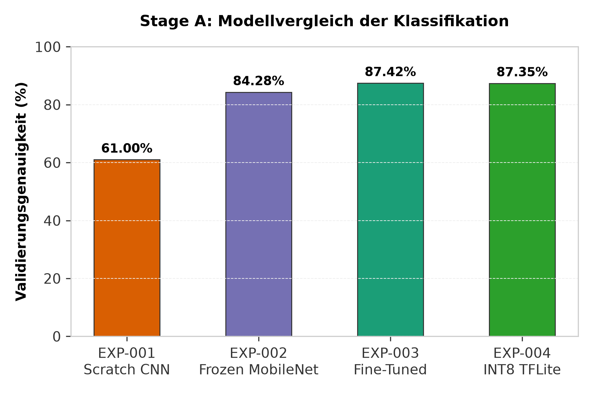
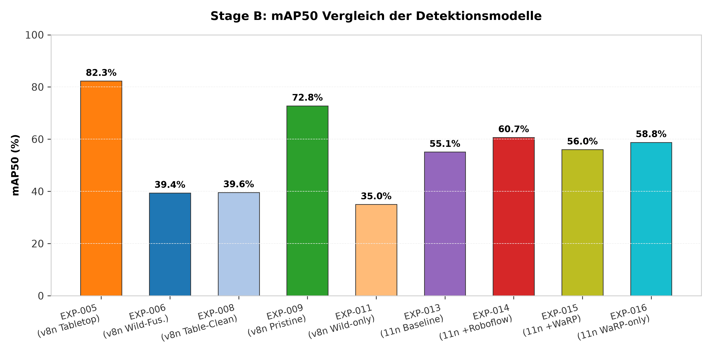
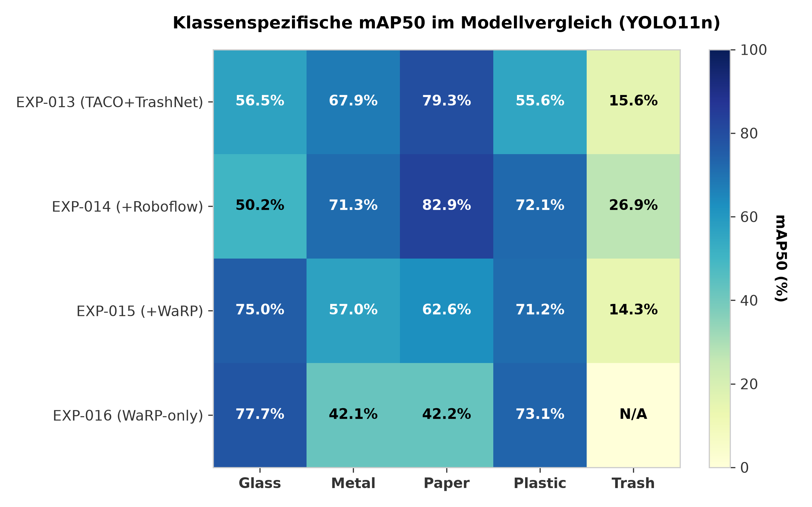
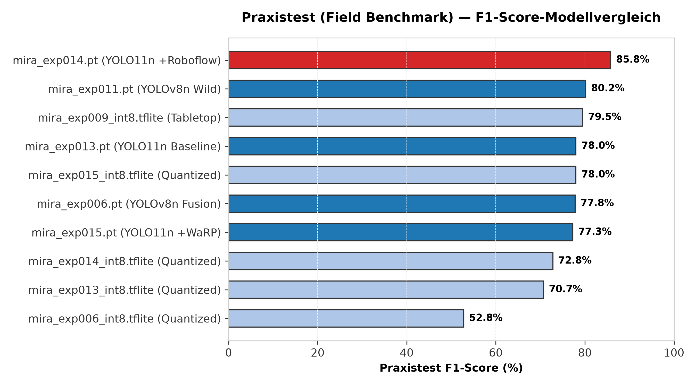
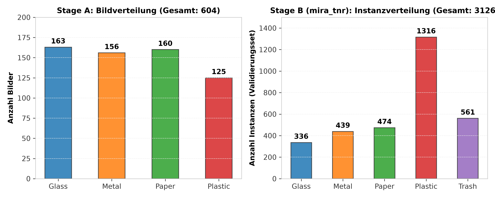

# MIRA — Machine Intelligence for Recycling Automation

[](https://www.jugend-forscht.de/)
[](https://www.python.org/downloads/release/python-3110/)
[](LICENSE)
[](https://github.com/jeremy341/MIRA-AI/actions/workflows/ci.yml)
[](https://github.com/jeremy341/MIRA-AI/commits/main)

A lightweight, edge-AI-optimized computer vision system for automated recycling sorting — targeting deployment on resource-constrained hardware such as the Raspberry Pi Zero 2W. MIRA progresses from image classification (Stage A) to real-time multi-object detection with tracking (Stage B), with a systematic 4-model comparison to find the optimal training data mix for YOLO11n.

> **Quick start:** `.\mira live` → interactive model picker → live webcam detection

<!-- ============================================================ -->
<!-- PLACEHOLDER: Add a 10-second GIF of live detection here       -->
<!-- Record `.\mira live --model mira_exp014.pt` detecting objects -->
<!-- Save as assets/demo-live-detection.gif                        -->
<!-- ============================================================ -->
<!--  -->

---

## Features

- **16 systematic experiments** — from baseline CNN to YOLO11n with full quantitative metrics
- **18 trained models** committed via Git LFS — ready to use without retraining
- **Research Pipeline** — YAML-driven config, plugin CLI registry, dataset registry, model adapters, configurable training
- **Third-party model support** — drop `.pt`/`.tflite`/`.pth` + optional YAML descriptor in `models/detection/` for instant benchmarking
- **B&W Control Center** — FastAPI+WebSocket dashboard with real-time inventory chart
- **Edge-optimized** — INT8 quantized models as small as **2.6 MB** (classifier) and **2.9 MB** (detector)
- **Multi-dataset fusion** — TACO + TrashNet + Roboflow + WaRP, tested in 4 combinations

---

## Table of Contents

- [Quick Start](#quick-start)
- [Configuration](#configuration)
- [Architecture](#architecture)
- [Research Pipeline](#research-pipeline)
- [Models](#models)
- [Results](#results)
- [Dataset](#dataset)
- [Dashboard](#dashboard)
- [CLI Reference](#cli-reference)
- [Training on Kaggle](#training-on-kaggle)
- [Hardware Requirements](#hardware-requirements)
- [Project Structure](#project-structure)
- [Known Limitations](#known-limitations)
- [Reproducibility](#reproducibility)
- [Related Work](#related-work)
- [Citation](#citation)
- [Contributing](#contributing)
- [License](#license)
- [Acknowledgments](#acknowledgments)

---

## Quick Start

### Installation

```bash
git clone https://github.com/jeremy341/MIRA-AI.git
cd MIRA-AI
python -m venv .venv
.venv\Scripts\Activate.ps1      # Windows PowerShell
pip install -r requirements.txt
```

> **Note:** Development dependencies (pytest, mypy, ruff) are included in `requirements.txt`. For a production-only install, install only the core packages listed at the top of the file.

### Live Detection

> **Platform note:** On Windows, use `.\mira` (PowerShell) or `mira.bat` (CMD). On Linux/macOS, use `python -m src.cli`.

```bash
# Interactive model picker (arrow keys to choose)
.\mira live

# Direct launch with best model
.\mira live --model mira_exp014.pt

# With custom settings
.\mira live --model mira_exp014.pt --conf 0.25 --reject 0.55 --resolution 1280x720
```

### Dashboard

```bash
.\mira dashboard                     # Opens at http://localhost:5000
.\mira dashboard --port 8080         # Custom port
.\mira dashboard --host 127.0.0.1    # Localhost only
```

### Research Pipeline

```bash
# List available dataset sources
.\mira datasets

# Merge selected sources into a unified training set
.\mira merge --sources taco_trashnet roboflow --output datasets/mira_merged

# Train via experiment config
.\mira train --config experiments/exp014_yolo11n_multidataset.yaml

# Or train with inline flags
.\mira train --model yolo11n.pt --dataset datasets/mira_v2/dataset.yaml --epochs 50

# Benchmark multiple models
.\mira benchmark --models mira_exp014.pt mira_exp014_int8.tflite

# List discovered models
.\mira models
```

<details open>
<summary><strong>All CLI Commands</strong></summary>

| Command | Description |
|---|---|
| `.\mira live` | Interactive model picker — arrow keys to choose, Enter to confirm |
| `.\mira dashboard` | Launch FastAPI+WebSocket web control center |
| `.\mira data-viz` | Visualize dataset class distribution and sample grids |
| `.\mira train-baseline` | Train the 3-layer custom CNN (EXP-001) |
| `.\mira train-transfer` | Train MobileNetV2 with frozen base (EXP-002) |
| `.\mira train-tune` | Fine-tune MobileNetV2 from layer 100 (EXP-003) |
| `.\mira train-detection` | Run YOLOv8 detection training pipeline (legacy) |
| `.\mira quant-class` | Post-training INT8 quantization of the Keras classifier |
| `.\mira quant-yolo` | Export YOLOv8 model to INT8 TFLite |
| `.\mira eval-class --model <file> --exp <EXP>` | Evaluate a classification model |
| `.\mira eval-yolo --model <file>` | Evaluate a YOLO detection model |
| `.\mira field-bench` | Real-world model comparison on webcam images |
| `.\mira datasets` | List registered dataset sources from `datasets/registry/*.yaml` |
| `.\mira merge` | Merge registered dataset sources into a unified YOLO dataset |
| `.\mira train` | Train a YOLO detection model via the research pipeline |
| `.\mira experiments` | List all experiment YAML configs in `experiments/` |
| `.\mira export` | Export a trained `.pt` model to TFLite / ONNX |
| `.\mira benchmark` | Benchmark multiple models for accuracy and latency |
| `.\mira models` | List all discovered model files in `models/` |

</details>

<details>
<summary><strong>Live Command Flags</strong></summary>

| Flag | Default | Description |
|---|---|---|
| `--model` | Interactive picker | Model filename (omit for arrow-key picker) |
| `--camera` | `0` | Camera device index |
| `--resolution` | `640x360` | Capture resolution: `640x360`, `1280x720`, `1920x1080` |
| `--conf` | `0.5` | Confidence threshold |
| `--reject` | `0.55` | Reject threshold (detections below this labeled "unsicher") |
| `--target-latency` | `50` | Target latency in ms (skips frames if exceeded) |

</details>

---

## Installation Troubleshooting

| Issue | Solution |
|-------|----------|
| `ai_edge_litert` import error | Windows-only: install via `pip install ai-edge-litert`. Not needed on Raspberry Pi (use `tflite-runtime`). |
| CUDA out of memory | Use `--imgsz 320` instead of 640, or close other GPU applications. |
| Camera not opening (Windows) | Ensure no other app is using the webcam. Try `--camera 1` to switch device index. |
| `No module named 'ultralytics'` | Run `pip install ultralytics>=8.3.0` |

---

## Configuration

MIRA uses `mira.yaml` as the single source of truth for project-wide settings. All scripts, CLI commands, and the pipeline read from this file.

```yaml
# mira.yaml — key settings
classes:
  names: ["glass", "metal", "paper", "plastic", "trash"]
  count: 5

training:
  default_model: yolo11n.pt
  default_epochs: 120
  default_batch_size: 32
  default_imgsz: 640

inference:
  reject_threshold: 0.55
  default_conf: 0.5
  default_iou: 0.7
```

CLI flags override `mira.yaml` defaults:
```bash
.\mira train --epochs 200 --batch-size 16    # Override training defaults
.\mira live --conf 0.25 --reject 0.60       # Override inference defaults
```

## Dataset Access

Training datasets are not included in this repository due to size. To reproduce training:

1. **TACO** (Trash Annotations in Context): Download from [GitHub](https://github.com/AlessandroSaviolo/TACO), convert with `scripts/build_raw_dataset.py`
2. **TrashNet**: Download from [Kaggle](https://www.kaggle.com/datasets/techsash/waste-classification-data), convert with `scripts/add_trashnet_to_dataset.py`
3. **Roboflow Trash Detection**: Download via Roboflow API, place in `datasets/roboflow_raw/`
4. **WaRP** (Waste Recognition Protocol): Download from [GitHub](https://github.com/DTUGreenAmbition/WaRP), place in `datasets/warp/`

After downloading, merge sources into training datasets:
```bash
# Unified merger (recommended)
py scripts/merge_dataset.py --sources taco_trashnet,roboflow       # → datasets/mira_tnr/
py scripts/merge_dataset.py --sources taco_trashnet,warp           # → datasets/mira_tnw/
py scripts/merge_dataset.py --sources warp                         # → datasets/mira_warp_only/
py scripts/merge_dataset.py --sources taco_trashnet,roboflow,warp  # → datasets/mira_all/

# Preview without copying
py scripts/merge_dataset.py --sources taco_trashnet,roboflow --dry-run
```

---

## Architecture

```
Webcam Input
     │
     ▼
┌─────────────────────────────────────────────────────┐
│  Stage A: Classification (single object per frame)  │
│                                                     │
│  Input (224×224) → MobileNetV2 → Dense(128) →       │
│  Dropout(0.2) → Softmax(4 classes)                  │
│                                                     │
│  Best model: mira_classifier_int8.tflite            │
│  Accuracy: 87.42% | Size: 2.61 MB | ~97 FPS CPU     │
└─────────────────────────────────────────────────────┘
     │
     ▼
┌─────────────────────────────────────────────────────┐
│  Stage B: Detection (multiple objects per frame)    │
│                                                     │
│  Input (640×640) → YOLO11n → NMS →              │
│  Bounding Boxes + Class Labels + ByteTrack IDs      │
│                                                     │
│  Best model (EXP-014): YOLO11n 60.7% mAP50         │
│  Dataset: TACO + TrashNet + Roboflow (multi-source)│
└─────────────────────────────────────────────────────┘
     │
     ▼
┌─────────────────────────────────────────────────────┐
│  Stage C: Robotic Sorting (planned)                 │
│                                                     │
│  USB Serial → ESP32-S3 → 3-DOF Servo Arm →         │
│  Pick-and-place into sorted bins                    │
│                                                     │
│  Protocol: Python sends "metal 120\n" →             │
│  ESP32 responds "done\n"                            │
└─────────────────────────────────────────────────────┘
```

> **Note:** Stage A classifiers were trained on 4 classes (glass, metal, paper, plastic) without the trash class. The 87.42% accuracy applies to this 4-class task. Stage B detectors operate on all 5 classes including trash.


### Confidence Reject System

MIRA uses a 3-tier confidence system to handle uncertain detections:

| Tier | Confidence Range | Visual | Behavior |
|---|---|---|---|
| **Rejected** | conf < 0.25 | Not drawn | Ignored entirely |
| **Uncertain** | 0.25 ≤ conf < reject_threshold | Yellow box, "unsicher" | Shown but not counted in inventory |
| **Confident** | conf ≥ reject_threshold | Green box, class label | Counted in inventory |

The reject threshold is configurable via the dashboard slider or `--reject` CLI flag.

> **Note:** The 0.25 lower bound is only active when explicitly passed via `--conf 0.25` or when loading INT8 TFLite models (which auto-set conf to 0.25). With default `--conf 0.5`, only boxes with confidence ≥0.5 are drawn.

---

## Research Pipeline

MIRA includes a modular research pipeline for systematic experimentation. The pipeline is YAML-driven, plugin-based, and designed for extensibility.

```
 CLI (cli.py)
   │
   ├─ datasets ──→ DatasetRegistry ──→ datasets/registry/*.yaml
   │                                        │
   ├─ merge ─────→ copy_passthrough ───────→ datasets/<merged>/
   │                copy_remapped_images         │
   │                                             ▼
   ├─ train ─────→ TrainingPipeline ──→ models/detection/*.pt
   │                (experiments/*.yaml)         │
   │                                             ▼
   ├─ export ────→ model.export() ────→ models/detection/*_int8.tflite
   │                                             │
   ├─ benchmark ─→ ModelBenchmark ───→ results/benchmark_*.json
   │                (YOLOAdapter,                   │
   │                 YOLOTFLiteAdapter,             ▼
   │                 ThirdPartyAdapter)       comparison_table()
   │
   └─ models ────→ ModelRegistry ────→ models/detection/*.pt + *.tflite + *.yaml
                   (auto-discovery)
```

### Extension Points

| What | Where | How |
|---|---|---|
| New CLI command | `src/pipeline/registry.py` | Add module, register with `@register_command` |
| New dataset source | `datasets/registry/` | Drop a YAML descriptor |
| New model format | `src/pipeline/models.py` | Add adapter class with `@register_model_adapter` |
| New training strategy | `src/pipeline/train.py` | Add strategy fn, expose as CLI flag |
| New export target | `src/pipeline/train.py` | Add exporter in `TrainingPipeline.export` |
| New benchmark metric | `src/pipeline/benchmark.py` | Add metric fn, include in report output |

### Adding a Third-Party Model

1. Place the model file (`.pt`, `.tflite`, `.pth`) in `models/detection/`
2. Create a YAML descriptor (see `models/detection/example_third_party.yaml`):
   ```yaml
   name: "My Custom Model"
   type: tflite
   model_file: my_model.tflite
   imgsz: 320
   class_names: [glass, metal, paper, plastic, trash]
   ```
3. Run `.\mira models` to verify it appears
4. Run `.\mira benchmark --models my_custom_model --dataset datasets/mira_all`

Ultralytics-compatible models (`.pt`, `.tflite`) work out of the box — the adapter loads them via `ultralytics.YOLO()` automatically.

---

## Models

### Stage A — Classification

| Model | Val Accuracy | Size | Speed (CPU) | Notes |
|---|---|---|---|---|
| `mira_classifier_baseline.keras` | 61.00% | 45.71 MB | ~10 FPS | 3-layer custom CNN — baseline only |
| `mira_classifier_transfer.keras` | 84.28% | 9.25 MB | ~50 FPS | MobileNetV2 frozen base, fast to train |
| `mira_classifier_tuned.keras` | **87.42%** | 23.48 MB | ~35 FPS | MobileNetV2 fine-tuned, best Keras accuracy |
| `mira_classifier_fp32.tflite` | 87.42% | 8.49 MB | ~70 FPS | TFLite export, no quality loss |
| `mira_classifier_int8.tflite` | **87.42%** | **2.61 MB** | **~97 FPS** | **Best for deployment** — INT8 quantized |

### Stage B — Detection

| Model | mAP50 | Params | Size | Notes |
|---|---|---|---|---|
| `mira_exp014.pt` | **60.7%** | 2.58M | 5.21 MB | **CURRENT BEST** — YOLO11n + Roboflow |
| `mira_exp014_int8.tflite` | 60.7% | 2.58M | 2.90 MB | INT8 quantized (edge deployment) |
| `mira_exp016.pt` | 58.8% | 2.58M | 5.21 MB | YOLO11n + WaRP only |
| `mira_exp015.pt` | 56.0% | 2.58M | 5.21 MB | YOLO11n + WaRP + TrashNet |
| `mira_exp013.pt` | 55.1% | 2.58M | 5.21 MB | YOLO11n + TACO + TrashNet |
| `mira_exp006.pt` | 39.4% | 3.01M | 5.94 MB | YOLOv8n multi-dataset, proven in demos |
| `mira_exp011.pt` | 35.0% | 3.01M | 5.94 MB | YOLOv8n TACO-only |
| `mira_exp009_int8.tflite` | 72.8% | 3.01M | 3.18 MB | **WEAK** — inflated by clean backgrounds |

> **Recommendation:** Use `mira_exp014.pt` for desktop demos and `mira_exp014_int8.tflite` for edge deployment on Raspberry Pi.

---

## Results

### Classification — Transfer Learning Progression

| Experiment | Architecture | Dataset | Val Accuracy | Size |
|---|---|---|---|---|
| EXP-001 | Custom CNN (3-layer) | 796 images | 61.00% | 45.71 MB |
| EXP-002 | MobileNetV2 (frozen) | 796 images | 84.28% | 9.25 MB |
| EXP-003 | MobileNetV2 (fine-tuned) | 796 images | **87.42%** | 23.48 MB |
| EXP-004 | MobileNetV2 INT8 TFLite | 796 images | 87.42% | **2.61 MB** |



### Detection — 11 Experiments (EXP-005–016, excl. EXP-007)

> EXP-007 was an exploratory attempt and is excluded from the main results table.

| Exp | Model | Dataset | mAP50 | Platform |
|---|---|---|---|---|
| EXP-005 | YOLOv8n | Custom + TrashNet (~3,300 img) | 82.3% | Colab T4 |
| EXP-006 | YOLOv8n | Fused Wild + TrashNet | 39.4% | Colab T4 |
| EXP-008 | YOLOv8n | Pruned Tabletop (~3,000 img) | 39.6% | Colab T4 |
| EXP-009 | YOLOv8n | Pristine TrashNet (~2,527 img) | **72.8%** | Kaggle T4 |
| EXP-010 | YOLOv8n INT8 | Wild + TrashNet (quantized) | 35.0% | — |
| EXP-011 | YOLOv8n | TACO only (3,365 img) | 35.0% | Kaggle T4 |
| EXP-012 | YOLOv8n INT8 | TACO only (quantized) | 35.0% | — |
| **EXP-013** | **YOLO11n** | **TACO + TrashNet (4,024 img)** | **55.1%** | **Kaggle T4** |
| **EXP-014** | **YOLO11n** | **mira_tnr (6,802 img)** | **60.7%** | **Kaggle T4** |
| **EXP-015** | **YOLO11n** | **mira_tnw (~6,800 img)** | **56.0%** | **Kaggle T4** |
| **EXP-016** | **YOLO11n** | **mira_warp_only (~3,000 img)** | **58.8%** | **Kaggle T4** |



### 4-Dataset Comparison

To find the optimal training data mix, we trained YOLO11n on 4 dataset combinations:

| Model | Datasets | ~Images | mAP50 | Merge Command |
|---|---|---|---|---|
| Model 1 | TACO + TrashNet + Roboflow | 6,802 | **60.7%** | `py scripts/merge_dataset.py --sources taco_trashnet,roboflow` |
| Model 2 | TACO + TrashNet + WaRP | ~6,800¹ | 56.0% | `py scripts/merge_dataset.py --sources taco_trashnet,warp` |
| Model 3 | WaRP only | ~3,000 | 58.8% | `py scripts/merge_dataset.py --sources warp` |
| Model 4 | All four datasets | ~17,000 | Planned | `py scripts/merge_dataset.py --sources taco_trashnet,roboflow,warp` |

¹ Raw WaRP contains ~10,000 images across 28 classes; only images with one of the 5 MIRA-mapped classes are kept, yielding ~2,800. Combined with TACO+TrashNet (3,924), the actual training set is ~6,800 images — consistent with EXP-015.



> **Key finding:** Roboflow (EXP-014) outperforms WaRP (EXP-015) by +4.7 pp mAP50. Roboflow helps Trash (+11.3 pp), while WaRP helps Glass (+24.8 pp) but hurts Trash (-12.6 pp) since WaRP has zero trash-class images.

### Field Benchmark — Real-World Validation

11 models tested on real webcam images with manually labeled ground truth.

(**Image-level class-presence F1** — see [field_benchmark_results.md](results/field_benchmark_results.md) for details. This is different from detection mAP50 which measures bounding-box localization quality.)



Full per-class metrics, confusion matrices, and training curves: [`results/experiments_log.md`](results/experiments_log.md)

---

## Dataset

### Sources

| Dataset | Classes | Images | Format | Use | License |
|---|---|---|---|---|---|
| [TACO](http://tacodataset.org/) | 60 | 1,500 | COCO | Base detection data | CC-BY-4.0 |
| [TrashNet](https://github.com/garythung/trashnet) | 6 | 2,527 | Classification | Stage A + bbox via SAM | MIT-0 |
| [Roboflow Trash Detection](https://universe.roboflow.com/robotics-world) | 64 | ~3,300 | YOLO | Multi-class detection | Varies by dataset (see individual dataset pages) |
| [WaRP](https://github.com/FrankFao/WaRP) | 28 | ~10,000 | YOLO | Glass/plastic detection | Research use only (contact authors) |

### Class Schema

All datasets are remapped to 5 unified classes:

| Class | TACO | TrashNet | Roboflow | WaRP |
|---|---|---|---|---|
| glass | Glass jar | Glass | Glass | Glass bottle |
| metal | Metal can | Metal | Metal | Aluminum can |
| paper | Paper | — | Cardboard, Paper | Paper bag |
| plastic | Plastic bottle | Plastic | Plastic, Styrofoam | Plastic bottle |
| trash | Other | — | Trash, Biodegradable | — |



### Merge Scripts

```bash
# Unified merger (recommended)
py scripts/merge_dataset.py --sources taco_trashnet,roboflow       # → datasets/mira_tnr/
py scripts/merge_dataset.py --sources taco_trashnet,warp           # → datasets/mira_tnw/
py scripts/merge_dataset.py --sources warp                         # → datasets/mira_warp_only/
py scripts/merge_dataset.py --sources taco_trashnet,roboflow,warp  # → datasets/mira_all/

# Preview without copying
py scripts/merge_dataset.py --sources taco_trashnet,roboflow --dry-run

# Legacy: Model 4 (all datasets combined)
py scripts/merge_dataset_model4.py
```

---

## Dashboard

<!-- ============================================================ -->
<!-- PLACEHOLDER: Add dashboard screenshot here                   -->
<!-- Run `.\mira dashboard`, open http://localhost:5000            -->
<!-- Screenshot the full B&W interface                            -->
<!-- Save as assets/dashboard-screenshot.png                      -->
<!-- ============================================================ -->
<!--  -->

The MIRA Control Center is a FastAPI+WebSocket web dashboard with a B&W monochrome design.

### Features

- **Live video feed** with bounding boxes and confidence scores
- **Model selector** — switch between any detection model on the fly
- **Confidence slider** — adjust detection threshold in real-time
- **Reject threshold slider** — set the "unsicher" boundary (0.10–1.00)
- **IoU slider** — adjust non-maximum suppression overlap
- **Image size selector** — 320, 416, or 640
- **Tracking toggle** — enable/disable ByteTrack object tracking
- **Camera index** — switch between connected cameras
- **Real-time inventory chart** — Chart.js bar chart counting sorted objects by material
- **FPS and latency metrics** — updated per frame

### Launch

```bash
.\mira dashboard                     # http://localhost:5000
.\mira dashboard --port 8080         # Custom port
.\mira dashboard --host 127.0.0.1    # Localhost only
```

---

## CLI Reference

### Data Commands

| Command | Description |
|---|---|
| `.\mira data-viz` | Visualize dataset class distribution and sample grids |

### Training Commands

| Command | Experiment | Description |
|---|---|---|
| `.\mira train-baseline` | EXP-001 | Train 3-layer custom CNN |
| `.\mira train-transfer` | EXP-002 | Train MobileNetV2 with frozen base |
| `.\mira train-tune` | EXP-003 | Fine-tune MobileNetV2 from layer 100 |
| `.\mira train-detection` | EXP-005+ | Run YOLOv8 detection training pipeline |

### Quantization Commands

| Command | Description |
|---|---|
| `.\mira quant-class` | Post-training INT8 quantization of the Keras classifier |
| `.\mira quant-yolo` | Export YOLOv8 model to INT8 TFLite |

### Evaluation Commands

```bash
# Evaluate a classification model
.\mira eval-class --model mira_classifier_int8.tflite --exp EXP-004_Quantized_INT8

# Evaluate a YOLO detection model
.\mira eval-yolo --model mira_exp014.pt

# With custom dataset
.\mira eval-yolo --model mira_exp014.pt --data path/to/dataset.yaml

# TFLite models auto-detect input size
.\mira eval-yolo --model mira_exp009_int8.tflite   # auto imgsz=320
.\mira eval-yolo --model mira_exp011_int8.tflite   # auto imgsz=320
```

### Deployment Commands

| Command | Description |
|---|---|
| `.\mira live` | Interactive model picker — arrow keys to choose |
| `.\mira live --model mira_exp014.pt` | Direct launch with specific model |
| `.\mira live --model mira_exp014_int8.tflite` | INT8 edge deployment |
| `.\mira live --camera 1` | Use specific camera by index |
| `.\mira live --resolution 1280x720` | Higher resolution display |
| `.\mira live --conf 0.25 --reject 0.55` | Custom confidence/reject thresholds |
| `.\mira dashboard` | Launch web control center |

### Pipeline Commands

| Command | Description |
|---|---|
| `.\mira datasets` | List registered dataset sources from `datasets/registry/*.yaml` |
| `.\mira merge` | Merge selected sources into a unified YOLO dataset |
| `.\mira train` | Train a YOLO detection model via the research pipeline |
| `.\mira experiments` | List all experiment YAML configs in `experiments/` |
| `.\mira export` | Export a trained `.pt` model to TFLite / ONNX |
| `.\mira benchmark` | Benchmark multiple models for accuracy and latency |
| `.\mira models` | List all discovered model files in `models/` |

```bash
# Full pipeline example
.\mira datasets                                                    # List available sources
.\mira merge --sources taco_trashnet,roboflow --output datasets/mira_tnr
.\mira train --config experiments/exp014_yolo11n_multidataset.yaml
.\mira export --model models/detection/mira_exp014.pt --format tflite --int8
.\mira benchmark --models mira_exp014.pt mira_exp014_int8.tflite --dataset datasets/mira_tnr
.\mira models                                                       # Verify model discovery
```

---

## Training on Kaggle

All detection models train with YOLO11n using `scripts/train_detector_kaggle.py` on Kaggle (free T4 GPU).

### Steps

1. Upload the dataset ZIP to Kaggle
2. Open the notebook and run with argparse flags:

```bash
# Default (Model 1, YOLO11n, 120 epochs)
py scripts/train_detector_kaggle.py

# Model 2
py scripts/train_detector_kaggle.py --dataset mira_tnw

# Model 3 (WaRP only, fewer epochs)
py scripts/train_detector_kaggle.py --dataset mira_warp_only --epochs 80 --batch-size 16

# Model 4 (all data, longer training)
py scripts/train_detector_kaggle.py --dataset mira_all --epochs 200

# Different architecture
py scripts/train_detector_kaggle.py --model yolo8n.pt --dataset mira_tnr
```

### Flags

| Flag | Default | Description |
|---|---|---|
| `--dataset` | `mira_tnr` | Kaggle dataset name |
| `--model` | `yolo11n.pt` | Base model architecture |
| `--epochs` | `120` | Training epochs |
| `--batch-size` | `32` | Batch size |
| `--img-size` | `640` | Image size |
| `--patience` | `30` | Early stopping patience |
| `--device` | `0` | GPU device ID |
| `--lr0` | `0.01` | Initial learning rate |

---

## Hardware Requirements

| Use Case | Minimum Hardware | Recommended |
|---|---|---|
| Running inference | Any modern CPU | Intel i5 / Ryzen 5 or better |
| Live detection (`.\mira live`) | USB webcam at 640x360 | Any webcam supporting 640x360 |
| Retraining Stage A | CPU only is fine | GPU (CUDA) for speed |
| Retraining Stage B (YOLO) | GPU required | Google Colab / Kaggle T4 |
| Edge deployment target | Raspberry Pi Zero 2W | Raspberry Pi 4 |

### Camera Optimizations

All camera scripts apply these optimizations for stable, low-latency capture:

| Optimization | Setting | Effect |
|---|---|---|
| **MJPG codec** | `CAP_PROP_FOURCC = MJPG` | 3–5x faster frame decode vs. YUY2 |
| **DirectShow backend** | `cv2.CAP_DSHOW` | Windows-native driver, lower overhead |
| **Buffer size 1** | `CAP_PROP_BUFFERSIZE = 1` | Always delivers the freshest frame |
| **Explicit 30 FPS** | `CAP_PROP_FPS = 30` | Prevents silent 15 FPS default |
| **Manual exposure** | `CAP_PROP_AUTO_EXPOSURE = 1` | Prevents per-frame brightness shifts |
| **Autofocus off** | `CAP_PROP_AUTOFOCUS = 0` | Eliminates mid-inference blur |
| **Warmup frames** | 10 frames discarded on start | Lets auto-exposure settle |

The live detection engine runs camera capture in a **background thread** (`CameraStream` class), decoupling frame grabbing from inference so the main loop always processes the newest available frame.

---

## Project Structure

```text
MIRA-AI/
├── mira.yaml                       # Single source of truth: classes, paths, training defaults
│
├── src/                            # Runtime tools
│   ├── cli.py                      # Unified MIRA command-line interface (21 commands)
│   ├── config.py                   # Shared paths, constants, and utilities
│   ├── inference_engine.py         # Camera setup, model loading, inference loop
│   ├── visualize.py                # Bounding-box drawing with 3-tier confidence
│   ├── field_benchmark.py          # Real-world model comparison
│   ├── logger.py                   # Singleton logger
│   ├── model_picker.py             # Interactive arrow-key model selector
│   ├── dashboard/                   # FastAPI+WebSocket web control center
│   │   ├── main.py                  # FastAPI server (REST + WebSocket)
│   │   ├── camera_service.py        # Camera + YOLO inference management
│   │   ├── websocket_handler.py     # WebSocket video streaming
│   │   ├── models.py                # Pydantic data models
│   │   ├── requirements.txt         # Dashboard dependencies
│   │   └── templates/
│   │       └── dashboard.html       # Ultralytics-themed frontend (2964 lines)
│   └── pipeline/                   # Research pipeline framework
│       ├── __init__.py             # Public API exports
│       ├── registry.py             # Plugin registry: @register_command, @register_dataset_source
│       ├── dataset.py              # DatasetRegistry: YAML-based dataset source management
│       ├── models.py               # Model adapters: YOLOAdapter, YOLOTFLiteAdapter, ThirdPartyAdapter
│       ├── train.py                # TrainingPipeline: configurable YOLO training
│       └── benchmark.py            # ModelBenchmark: accuracy + latency comparison
│
├── scripts/                        # Dataset merge, training, and utility scripts
│   ├── merge_dataset.py            # Unified dataset merger (--sources flag)
│   ├── merge_utils.py              # Shared merge helpers (copy_passthrough, copy_remapped_images)
│   ├── merge_dataset_mira_v3.py    # MIRA v3 dataset builder
│   ├── merge_dataset_model4.py     # Legacy: Model 4 (all datasets)
│   ├── train_detector_kaggle.py    # Configurable Kaggle training
│   ├── capture_classifier_frames.py  # Webcam data collection (Stage A)
│   ├── visualize_classifier_dataset.py  # Dataset distribution viewer
│   ├── generate_report_plots.py    # LaTeX figure generation
│   ├── add_trashnet_to_dataset.py  # TrashNet bbox labeling via SAM
│   ├── label_trashnet_with_sam.py  # SAM-assisted bounding box labeling
│   ├── class_mappings.py           # Class name remapping tables
│   └── build_raw_dataset.py        # Raw dataset builder
│
├── models/                         # All trained model exports (Git LFS)
│   ├── classifier/                 # Stage A: Keras + TFLite
│   │   ├── mira_classifier_baseline.keras
│   │   ├── mira_classifier_transfer.keras
│   │   ├── mira_classifier_tuned.keras
│   │   ├── mira_classifier_fp32.tflite
│   │   └── mira_classifier_int8.tflite      ← Best deployment model
│   └── detection/                  # Stage B: YOLO .pt + .tflite + third-party
│       ├── mira_exp014.pt                 ← CURRENT BEST
│       ├── mira_exp014_int8.tflite        ← Best for edge deployment
│       ├── example_third_party.yaml       # Example: drop .pt/.tflite + YAML here
│       └── ... (14 models total)
│
├── experiments/                    # Training experiment configs (YAML)
│   ├── exp009_yolov8n_int8.yaml
│   ├── exp013_yolo11n_taco_trashnet.yaml
│   └── exp014_yolo11n_multidataset.yaml
│
├── data/
│   └── classes/                    # Manually collected Stage A webcam images
│       ├── glass/  metal/  paper/  plastic/  trash/
│
├── datasets/                       # Detection datasets (gitignored)
│   ├── registry/                   # Dataset YAML descriptors for pipeline
│   ├── mira_v2/                    # TACO + TrashNet (3,924 images)
│   ├── mira_tnr/                   # Model 1: TACO+TrashNet+Roboflow
│   ├── mira_tnw/                   # Model 2: TACO+TrashNet+WaRP
│   └── mira_all/                   # Model 4: all four combined
│
├── results/                        # Experiment outputs and logs
│   ├── experiments_log.md          # Full quantitative metrics (16 experiments)
│   ├── field_benchmark_results.md
│   └── exp014_yolo11n_tnr/         # Confusion matrices, training curves
│
├── latex/                          # Jugend Forscht report
│   ├── main.tex                    # LaTeX source
│   ├── main.pdf                    # Compiled report (22 pages)
│   ├── figures/                    # 19 PNG figures
│   └── references.bib              # Bibliography
│
├── tests/                          # Test suite (45 tests)
│   ├── test_config.py
│   ├── test_field_benchmark.py
│   ├── test_visualize.py
│   └── test_pipeline.py
│
├── .github/workflows/ci.yml       # GitHub Actions: Ruff lint + pytest
├── .gitattributes                  # Git LFS for model files
├── bytetrack.yaml                  # ByteTrack tracker configuration
├── pyproject.toml                  # Project metadata + Ruff + pytest config
├── requirements.txt                # Python dependencies
├── mira.bat                        # Windows CLI launcher
├── LICENSE                         # MIT License
└── README.md
```

---

## Known Limitations

- **Crumpled paper** — white crumpled paper is misclassified as plastic with 80–90% confidence. The reject threshold cannot help here (too confident). Needs more training data. Documented in the report discussion.
- **End-on metal cans** — cans facing the camera opening-first cause detection drop-outs due to limited training samples for this orientation.
- **Overlapping objects** — heavily stacked or occluded items reduce bounding box accuracy, particularly for paper and trash.
- **Trash class** — the catch-all "trash" class is the weakest performer across all experiments (as low as 7.1% mAP50) due to its inherent visual diversity.
- **No RPi benchmarks** — all latency measurements are on Intel i7 / NVIDIA T4, not the target Raspberry Pi Zero 2W.
- **Windows-only launcher** — `mira.bat` is Windows-specific. Linux/macOS users must call `python src/cli.py <command>` directly.

---

## Reproducibility

### Random Seeds

All scripts use fixed random seeds for deterministic results:
- **TensorFlow/Keras:** `seed=123`
- **NumPy / Python random:** `seed=42`

### Dataset Versions

Training datasets are downloaded from specific versions:
- **TACO:** [GitHub repo](https://github.com/AlessandroSaviolo/TACO) — commit used for conversion
- **TrashNet:** [Kaggle dataset](https://www.kaggle.com/datasets/techsash/waste-classification-data)
- **Roboflow:** [Roboflow Universe](https://universe.roboflow.com/robotics-world) — specific export versions linked in experiment logs
- **WaRP:** [GitHub repo](https://github.com/DTUGreenAmbition/WaRP)

### Model Checksums

All trained models are available in the `models/` directory. Model integrity can be verified against Kaggle notebook outputs.

### Kaggle Training Notebooks

For exact reproduction of training runs, refer to the Kaggle notebooks using `scripts/train_detector_kaggle.py`. Each experiment's hyperparameters are logged in `results/experiments_log.md`.

### Hardware

Results were generated on Intel i7 / NVIDIA T4. Raspberry Pi Zero 2W benchmarks pending.

---

## Related Work

| Work | Model | Classes | Dataset | mAP@0.5 | Notes |
|---|---|---|---|---|---|
| Nasien et al. (2025) | YOLO11 | 5 | 10,464 custom | ~94% acc | Accuracy metric, not mAP |
| Marwah & Chowanda (2025) | YOLO11s | household | TACO + custom | 72.6% | After quantization |
| Messai et al. (2025) | YOLO11-x | 8 | Industrial | 62.8% | 56.9M params vs MIRA's 2.58M |
| **MIRA EXP-014** | **YOLO11n** | **5** | **TACO+TrashNet+Roboflow** | **60.7%** | **2.9 MB INT8, edge-optimized** |

> Direct comparison is difficult because every study uses different class schemas, datasets, and evaluation protocols. MIRA's *trash* class (residual waste) is particularly challenging — most recycling datasets omit it entirely.

---

## Citation

If you use MIRA in your work, please cite:

```bibtex
@misc{mira2027,
  title={MIRA: Machine Intelligence for Recycling Automation},
  author={Jeremy Darko},
  year={2027},
  howpublished={Jugend forscht 2027},
  note={Gymnasium Broich, Mülheim an der Ruhr}
}
```

---

## Contributing

Contributions are welcome! Please feel free to submit a Pull Request.

1. Fork the repository
2. Create your feature branch (`git checkout -b feature/amazing-feature`)
3. Commit your changes (`git commit -m 'Add amazing feature'`)
4. Push to the branch (`git push origin feature/amazing-feature`)
5. Open a Pull Request

### Adding a New CLI Command

Use the plugin registry to add commands without editing existing files:

```python
# src/pipeline/my_module.py
from pipeline.registry import register_command

@register_command("my-command", "Description of what it does")
def cmd_my_command(args):
    print("Hello from my command!")

def setup(parser):
    parser.add_argument("--flag", help="Custom flag")
```

Then import the module in `cli.py` to activate it.

---

## License

This project is licensed under the MIT License — see the [LICENSE](LICENSE) file for details.

---

## Acknowledgments

- **Claude AI** (Anthropic) — development assistance and code review
- **Supervising Teacher** — Jugend Forscht project guidance
- **Sparkassenstiftung** — financial support
- **Kaggle** — free T4 GPU for model training
- **Ultralytics** — YOLO framework
- **TACO Dataset** — Trash Annotations in Context
- **Roboflow** — community waste detection dataset

---

<div align="center">

**MIRA** — Machine Intelligence for Recycling Automation

Jugend forscht 2027 · Gymnasium Broich · Mülheim an der Ruhr

</div>
